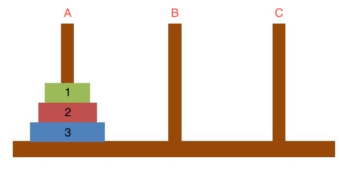

# 하노이 탑 알고리즘

## 문제 설명


'하노이의 탑'(Tower of Hanoi)은 A막대에 있는 1~3 원판을 C로 옮기는 문제이다.   

단, 다음 2가지 규칙이 존재한다.

1. 한번에 움직일 수 있는 원판은 기둥 맨 위에 놓인 원반 하나뿐 이다.
2. 어떠한 원판 위에 크기가 더 큰 원판이 올라 가서는 안된다.

이 조건 하에서 다음 문제를 풀 수 있다. 

- A 막대에 있는 모든 원판을 C 막대에 모두 옮기는 **과정을 모두 출력**
- A 막대에 있는 모든 원판을 C 막대에 모두 옮기는 **최소 횟수 구하기**

## 문제 해결법
먼저, 막대 A의 3개의 원판을 막대 C 로 옮기는 과정은 다음과 같다.
1. A 막대에 있는 1 원판을 막대 C로 옮긴다. [1: A -> C]
2. A 막대에 있는 2 원판을 막대 B로 옮긴다. [2: A -> B]
3. C 막대에 있는 1 원판을 막대 B로 옮긴다. [1: C -> B]
4. A 막대에 있는 3 원판을 막대 C로 옮긴다. [3: A -> C]
5. B 막대에 있는 1 원판을 막대 A로 옮긴다. [1: B -> A]
6. B 막대에 있는 2 원판을 막대 A로 옮긴다. [2: B -> C]
7. A 막대에 있는 1 원판을 막대 C로 옮긴다. [1: A -> C]

이를 일반화 한다면 다음과 같다.   
- A 막대를 start, B 막대를 via, C 막대를 dest 로 가정한다.
1. start 에 있는 원판 N - 1 개를 via 로 옮긴다.
2. start 에 있는 원판 N 을 dest 로 옮긴다.
3. via 에 있는 원판 N - 1 개를 dest 로 옮긴다.

다음과 같이 일반화 과정이 재귀적 특성을 가지는 것을 알 수 있다.

이를 일반화 해서 코드를 작성하면 다음과 같다.

``` python
    hanoi(N, start, to, dest):
        if N == 1:
            move(1, start, dest)
        hanoi(N - 1, start, dest, to)
        move(N, start, dest)
        hanoi(N - 1, to, start, dest)
```

이를 재귀식으로 작성하면 다음과 같다.
- hanoi(N) = 2 x hanoi(N - 1) + 1
- 1 (N == 1)

이 재귀식을 통해 **일반항**을 구하면 다음과 같다.

- **hanoi(N) = 2^N - 1**

### 정리

하노이 탑으로 다음 2가지 문제를 풀 수 있다.

1. **과정을 모두 출력**
   
    - 하노이 탑의 모든 과정을 보여줘야 하므로 **시간 복잡도 O(2^N - 1)** 이다. 
2. **최소 횟수 구하기**
    
   - 하노이 탑 재귀식에 입력값 N 만 대입하면 되므로 **시간 복잡도 O(1)** 이다.  


