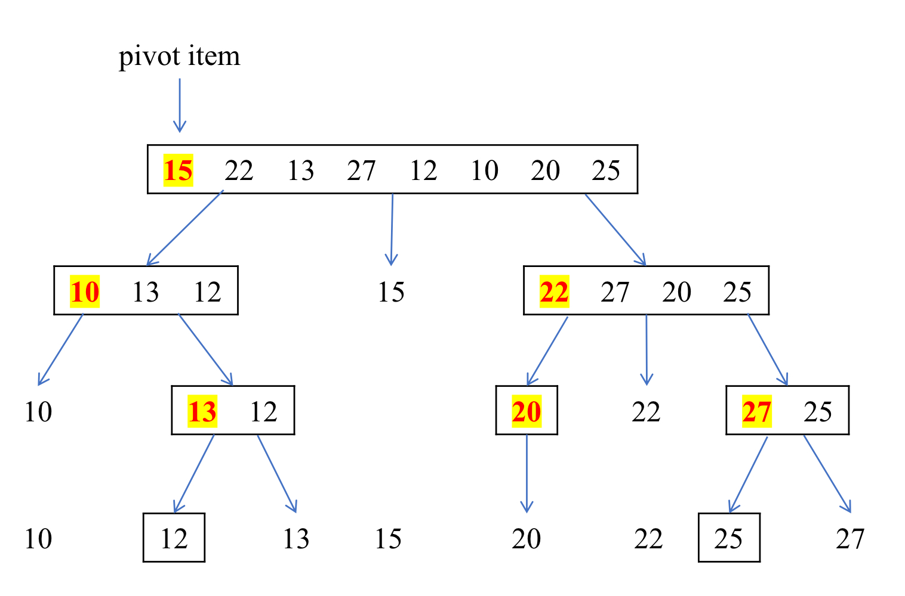

# 1. Selection Sorting (선택 정렬) 란?

- 다음과 같은 순서를 반복하며 정렬하는 알고리즘
    1. 주어진 데이터 중, 최소값을 찾음
    2. 해당 최소값을 데이터 맨 앞에 위치한 값과 교체함
    3. 맨 앞의 위치를 뺀 나머지 데이터를 동일한 방법으로 반복
- **[https://visualgo.net/en/sorting](https://visualgo.net/en/sorting)**

```python
def selection_sort(data):
    for stand in range(len(data) - 1):
        lowest = stand
        for index in range(stand + 1, len(data)):
            if data[lowest] > data[index]:
                lowest = index
        data[lowest], data[stand] = data[stand], data[lowest]
    return data
```

### Selection sort 시간 복잡도

- 선택 정렬은 반복문이 2개 이므로 시간 복잡도는 O(n^2) 이며, 실제로 상세히 계산하면 n * (n-1) / 2 이다.
---

# Bubble Sort (버블 정렬) 란?

• 두 인접한 데이터를 비교해서, 앞에 있는 데이터가 뒤에 있는 데이터보다 크면, 자리를 바꾸는 정렬 알고리즘

### 버블 정렬 구현

- n개의 리스트가 있는 경우 최대 n-1번의 로직을 적용한다.
- 로직을 1번 적용할 때마다 가장 큰 숫자가 뒤에서부터 1개씩 결정
- 로직이 경우에 따라 일찍 끝날 수도 있다. 따라서 로직을 적용할 때 한 번도 데이터가 교환된 적이 없다면 이미 정렬된 상태이므로 더 이상 로직을 반복 적용할 필요가 없다.

```python
def bubblesort(data):
    for index in range(len(data) - 1):
        swap = False
        for index2 in range(len(data) - index - 1):
            if data[index2] > data[index2 + 1]:
                data[index2], data[index2 + 1] = data[index2 + 1], data[index2]
                swap = True
        
        if swap == False:
            break
    return data
```

### 버블 정렬 시간 복잡도

- 반복문이 두 개이므로 O(n^2) 의 시간 복잡도를 갖는다.
- 최악의 경우: n * (n - 1) / 2
- 완전 정렬이 되어 있는 경우: O (n)

# Insertion sort (삽입 정렬) 란?

- 삽입 정렬은 두 번째 인덱스부터 시작
- 해당 인덱스(key 값) 앞에 있는 데이터(B)부터 비교해서 key 값이 더 작으면, B값을 뒤 인덱스로 복사
- 이를 key 값이 더 큰 데이터를 만날때까지 반복, 그리고 큰 데이터를 만난 위치 바로 뒤에 key 값을 이동

## Insertion sort 구현

```python
def insertion_sort(data):
    for index in range(len(data) - 1):
        for index2 in range(index + 1, 0, -1):
            if data[index2] < data[index2 - 1]:
                data[index2], data[index2 - 1] = data[index2 - 1], data[index2]
            else:
                break
    return data
```

### 버블 정렬 시간 복잡도

- 반복문이 두 개이므로 O(n^2) 의 시간 복잡도를 갖는다.
- 최악의 경우: n * (n - 1) / 2
- 완전 정렬이 되어 있는 경우: O (n)
---
# Merge Sort (합병 정렬) 란?

**Merge Sort (합병 정렬)** 란: 반복적으로 각 서브리스트의 구성 원소가 한개가 될 때까지 한 리스트를 쪼갠 후에 서브리스트들을 정렬하며 하나의 리스트로 merge 하는 정렬 방법

이것은 **Divide and Conquer** 원칙을 따르며 작동!!!

### **Divide and Conquer 란?**

> 큰 문제를 작은 문제 단위로 쪼개면서 해결해나가는 방식
> 

### ****Top-down Merge Sort 동작 방식****

Top-down merge sort 는 기본적으로 **recursion mechanism** 를 사용하는 정렬 기법이다.

1. 정렬되지 않은 리스트를 n 개의 서브리스트로 나눈다(divide). (이때 각 서브리스트를 구성하는 원소는 1개)
2. n 개의 서브리스트를 새로 정렬된 서브리스트를 생성하며 합병(merge)한다. 오직 1개의 정렬된 서브리스트만 남을 때까지!!

```cpp
void merge(int *Arr, int start, int mid, int end) {
	// 각 서브리스트를 합치기 위한 배열(temp) 생성
	int temp[end - start + 1];

	// 각 divide 되었다고 가정된 각각의 서브리스트의 시작 인덱스 설정
	int i = start, j = mid+1, k = 0;

	// divide 된 배열들의 원소들 중 더 작은 원소를 temp 배열에 추가
	while(i <= mid && j <= end) {
		if(Arr[i] <= Arr[j]) {
			temp[k] = Arr[i];
			k += 1; i += 1;
		}
		else {
			temp[k] = Arr[j];
			k += 1; j += 1;
		}
	}

	// 왼쪽 배열의 모든 원소가 temp 배열에 추가가 안된 경우
	while(i <= mid) {
		temp[k] = Arr[i];
		k += 1; i += 1;
	}
	
	// 오른쪽 배열의 모든 원소가 temp 배열에 추가가 안된 경우
	while(j <= end) {
		temp[k] = Arr[j];
		k += 1; j += 1;
	}

	// 정렬된 temp 배열을 기존 배열로 copy
	for(i = start; i <= end; i += 1) {
		Arr[i] = temp[i - start]
	}
}

void mergeSort(int *Arr, int start, int end) {

	if(start < end) {
		int mid = (start + end) / 2;
		mergeSort(Arr, start, mid);
		mergeSort(Arr, mid+1, end);
		merge(Arr, start, mid, end);
	}
```

### 시간 복잡도

| 평균 | 최선 | 최악 |
| --- | --- | --- |
| Θ(nlogn) | Ω(nlogn) | O(nlogn) |

### 공간 복잡도

| 평균 | 최선 | 최악 |
| --- | --- | --- |
| O(n) | O(n) | O(n) |

### Merge Sort 장점

- **Stable Sort(안정 정렬)** 에 속한다.
- 기존 다른 정렬에 비해 **빠른 정렬**에 속한다.

### Merge Sort 단점

- 정렬을 하는 배열외의 추가적인 임시 배열 (**추가적인 메모리**)가 필요
    - **In-place sort** 가 아니다. 즉, **Space complexity 가 높다**.
---

# Quick Sort (퀵 정렬) 란?

- **In-place sorting Algorithm** 으로 1962년 Hoare 의해 개발되었다.
- 다음 2가지 동작을 반복적으로 수행하며 정렬
    1. 한 리스트를 2개의 partition 으로 나눈다.
    2. 각각의 partition 을 **재귀적으로(recursively)** 정렬한다.
    
    ⇒ 이러한 방식은 Merge Sort 와 비슷하다.
    
- But, partition 을 나누는 과정에서 차이가 있다.
    - **Quick Sort**
        - 모든 요소 중 pivot item 보다 작은 값을 가지는 요소는 왼쪽 (before)
        - 모든 요소 중 pivot item 보다 큰 값을 가지는 요소는 오른쪽 (after)
        - Pivot item 은 리스트 중 어느 요소라도 될 수 있다.
            - 모든 요소 중 Pivot item 을 고르는 방법도 여러 가지 존재
    - **Merge Sort**
        - 모든 partition 을 구성하는 원소가 1개가 될 때까지 나눈다.

### Quick Sort 동작 방식

Pivot 원소는 리스트 내 어떠한 원소가 될 수 있지만 편의성을 위해 **가장 첫번째 원소를 pivot** 이라 가정



1. 배열 첫번째 원소를 **pivot** 이라 가정
2. 피벗 앞에는 피벗보다 값이 작은 원소들이 오고, 피벗 뒤에는 피벗보다 값이 큰 원소들이 오도록 배열을 2개의 Partition 으로 나눈다. ⇒ **분할(Divide)**
3. 분할된 2개의 partition 에 대해 재귀적으로 이 과정을 반복

```cpp
void quicksort(int low, int high) {
		int pivot;

		if (low < high) {
				partition(low, high, pivot);
				quicksort(low, pivot - 1);
				quicksort(pivot + 1, high);
		}
}

void partition(int low, int high, int &pivot) {
		int pivotitem = S[low];    // S[] 전역 변수 가정
		int j = low;
		
		for (int i = low + 1; i <= high; i++) {
				if (S[i] < pivotitem) {
						j++;
						swap(S[i], S[j]);
				}
		}
		pivot = j;
		swap(S[low], S[pivot]);
}
```

### 시간 복잡도

| 평균 | 최선 | 최악 |
| --- | --- | --- |
| Θ(nlogn) | Ω(nlogn) | O(n^2) |
- 왜 Quick Sort 의 Worst Case 가 O(n^2) 일까?
    - Quick Sort 는 균등하게 Partition 을 나누는 Merge Sort 와 달리 비균등하게 Partition 이 나눠진다.
- 왜 Quick Sort 는 비균등하게 나눠질까?
    - Pivot 를 기준으로 2개의 partition 으로 나눠진다.
    - Pivot 은 리스트의 어떤 원소도 될 수 있기에 어떤 원소를 pivot 으로 정하냐에 따라 나눠지는 partition이 달라질 수 있다.
- 어떤 경우에 O(n^2) 이 걸릴까?
    - 이미 정렬된 리스트의 경우 시간 복잡도가 O(n^2) 이다.

### 공간 복잡도

| 평균 | 최선 | 최악 |
| --- | --- | --- |
| O(logn) | O(logn) | O(n) |

### Quick Sort 장점

- 속도가 빠르다!
- 추가적인 메모리를 필요로 하지 않는다. ⇒ in-place sort
- 불필요한 데이터의 이동을 줄이고 먼 거리의 데이터를 교환한다. → 지역 locality 가 높아진다!!
- 한 번 결정된 피벗들이 추후 연산에서 제외되는 특성으로 시간 복잡도가 O(nlogn) 을 가지는 다른 정렬 알고리즘과 비교할 때도 가장 빠르다.

### Quick Sort 단점

- 정렬된 리스트에 대해선 퀵 정렬의 비균등 분할에 의해 오히려 수행시간이 더 많이 걸린다.
    - 이를 방지하기 위해 피벗을 선택할 때 중간값(medium)을 피벗을 선택하는 방법이 있다.
- Stable 하지 않은 정렬이다.
    - **Stable 하지 않다**: 같은 값에 대한 상대적인 순서를 보장하지 않는다.